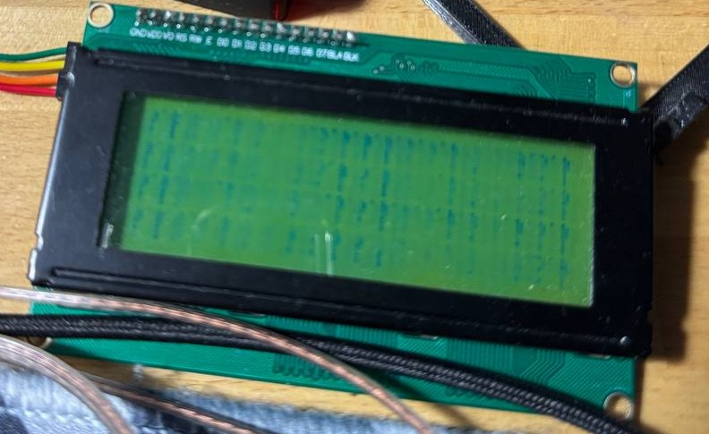

# Форк из репозитория Олега Волкова с уроками по STM32.

Былa взятa веткa с библиотекой для i2c расширителя портов в связке с LCD дисплеем. Этa библиотекa (только версия для китайских дисплеев) была адаптированa под мк фирмы Миландр серии К1986ВЕ92 (mdr1211).

Отлажена на плате MILUINO с чипом К1986ВЕ92FI. Совместимость можно гарантировать для К1986ВЕ92F1I и вероятно для К1986ВЕ92QI, однако последний уже снят с производства.
В интернете встречаются и другие названия этих микросхем:

* К1986ВЕ92(QI/FI/F1I)
* K1986VE92(QI/FI/F1I)
* K1986BE92(QI/FI/F1I) (здесь все символы латинские в первом случае первые 3 - кириллица)
* MDR1211FI
* MDR1211F1I
* MDR32F9Q2I
  
Такая неразбериха с названиями вызвана использованием одновременно русских и английских букв в названии причем символы имеют одинаковое начертание в обоих алфавитах.

Что касается самой библиотеки. Настоятельно рекомендую ознакомится с примером. Частота тактирования 80 мгц, предделитель для i2c = 39. Скорость обмена по формуле из даташита Fscl = (80 * 10^6)/(5*(39+1)) = 400000

Зависимости для примера лежат внутри, но для использования библиотеки вне примера они следующие:
* "MDR32FxQI_port.h" // для настройки GPIO
* "MDR32FxQI_rst_clk.h" // для настройки тактирования
* "MDR32FxQI_bkp.h" // для настройки тактирования
* "MDR32FxQI_eeprom.h" // для настройки тактирования
* <stdio.h> // для sprintf()
* "clk.h" // на моей плате кварц стоит на 16 МГц на вашей может быть другой - проверьте коэфициенты PLL
* "systick.h" // настройка systick для реализации delay() и GetTick()
* "MDR32FxQI_i2c.h" // для настройки и работы с i2c

В ходе отладки я заметил нестабильное поведение с миландром на длительных интервалах работы - где-то через часов 10-12 дисплей отваливался, на панели появлялись следущие артефакты, также дисплей мог зависнуть с текущим изображением или очиститься а потом зависнуть, при этом по i2c обмен шел без проблем. 

На данный момент мне вроде бы удалось побороть это, однако в случае появления багов пишите в issues, возможно вместе нам удасться исправить ситуацию.

p.s. Дополнить библиотеку до совместимости с дисплеями МЭЛТ, должно быть не очень сложно, но их у меня на руках нет. Если когда-нибудь появятся - добавлю.
